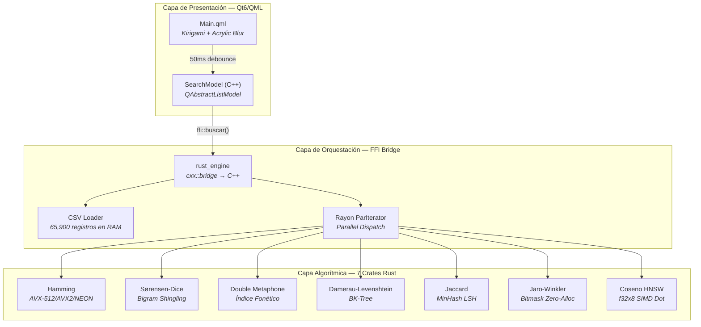

<div align="center">

# Catálogo de Bienes y Servicios

**Motor de Búsqueda Difusa de Alto Rendimiento — Arquitectura Multi-Algoritmo con Paralelización SIMD, Índices Métricos y Bridge FFI Rust↔C++/Qt6**


</div>

---

## Abstract

Motor de búsqueda difusa multi-algoritmo para catálogos de bienes y servicios gubernamentales (65,900+ registros). La arquitectura integra siete métricas de similitud complementarias —Hamming, Sørensen-Dice, Double Metaphone, Damerau-Levenshtein, Jaccard, Jaro-Winkler y Coseno HNSW— bajo un orquestador central Rust con despacho Rayon y bridge FFI `cxx` hacia un frontend Qt6/QML. Cada algoritmo resuelve una clase distinta de problema de similitud textual; la selección no es arbitraria sino que cubre el espectro completo de espacios métricos discretos, continuos y fonéticos.

---

## Arquitectura del Sistema



**Flujo de datos:** `Input → QML TextField → debounce 50ms → SearchModel::search() → ffi::buscar(query, AlgoritmoType) → Rayon par_iter → Vec<SearchResult> → QAbstractListModel → QML Delegate`

---

## 1. Distancia de Hamming — SIMD HPC Engine

### 1.1 Fundamento Matemático

La distancia de Hamming entre dos cadenas de igual longitud se define como:

$$d_H(\mathbf{x}, \mathbf{y}) = \sum_{i=1}^{n} \mathbb{1}[x_i \neq y_i]$$

En su formulación sobre vectores binarios (para `BitMap`), la operación se reduce a:

$$d_H(\mathbf{x}, \mathbf{y}) = \text{popcount}(\mathbf{x} \oplus \mathbf{y})$$

donde $\oplus$ denota la operación XOR bit-a-bit y `popcount` cuenta los bits activos en el resultado.

**Propiedades formales (métrica estricta):**

- Positividad: $d_H(x,y) \geq 0$
- Identidad de indiscernibles: $d_H(x,y) = 0 \iff x = y$
- Simetría: $d_H(x,y) = d_H(y,x)$
- Desigualdad triangular: $d_H(x,z) \leq d_H(x,y) + d_H(y,z)$
- Dominio: $\{0, 1, \ldots, n\}$ para vectores de $n$ bits

### 1.2 Dispatch SIMD

La implementación utiliza **dispatch estático en tiempo de compilación** mediante `cfg(target_feature)`, eliminando overhead de dispatch dinámico:

| Feature | Ancho de vector    | Operación por ciclo     |
| ------- | ------------------ | ----------------------- |
| AVX-512 | 8 × u64 = 512 bits | 8 popcounts simultáneos |
| AVX2    | 4 × u64 = 256 bits | 4 popcounts simultáneos |
| NEON    | 2 × u64 = 128 bits | 2 popcounts simultáneos |
| Escalar | 1 × u64            | Fallback                |

El `BitMap` utiliza bloques de `AlignedU64x4` (4 × u64 = 32 bytes) con `#[repr(align(32))]` para garantizar que las cargas SIMD nunca crucen fronteras de línea de caché L1.

### 1.3 Complejidad

| Operación                                  | Tiempo                         | Espacio |
| ------------------------------------------ | ------------------------------ | ------- |
| `popcount_xor`                             | $O(n/8)$ con AVX2              | $O(1)$  |
| `hamming_distance_u8`                      | $O(n)$                         | $O(1)$  |
| `find_by_attribute_distance` (N registros) | $O(N \times n/8)$              | $O(k)$  |
| `find_sku_typos` (N registros)             | $O(N \times \text{len}_{sku})$ | $O(k)$  |

---

## 2. Coeficiente de Sørensen-Dice

### 2.1 Fundamento Matemático

$$DSC(A, B) = \frac{2|A \cap B|}{|A| + |B|}$$

Los conjuntos $A$ y $B$ se construyen como **bigramas de grafemas Unicode**, hasheados a `u64` con AHash:

$$A = \{h(g_i \| g_{i+1}) \mid i = 0, \ldots, |\text{graphemes}|-2\}$$

donde $h$ es la función de hash AHash y $\|$ denota concatenación. Los conjuntos resultantes se ordenan y deduplican para habilitar la intersección con marcha de dos punteros.

**Propiedades:** Rango $[0, 1]$ (0 = disjuntos, 1 = idénticos). No es métrica estricta (no satisface la desigualdad triangular en general). Sensible a la longitud: el denominador penaliza asimetría en cardinalidades.

### 2.2 Optimización de Cota Superior (Early-Exit)

$$DSC_{max} = \frac{2 \cdot \min(|A|, |B|)}{|A| + |B|}$$

Si $DSC_{max} < \theta$ (umbral), entonces necesariamente $DSC(A,B) < \theta$, por lo que el registro se descarta sin computar la intersección. Esto reduce drásticamente el trabajo en catálogos con alta variabilidad de longitud de descripción.

### 2.3 Complejidad

| Operación                     | Tiempo                        | Espacio         |
| ----------------------------- | ----------------------------- | --------------- |
| `generate_shingles`           | $O(n \log n)$ (ordenación)    | $O(n)$          |
| `intersect_sorted`            | $O(\|A\| + \|B\|)$            | $O(1)$          |
| `dice_similarity`             | $O(\|A\| + \|B\|)$ amortizado | $O(1)$          |
| `search` (N registros, Rayon) | $O(N \times (k + \log k))$    | $O(N \times k)$ |

---

## 3. Double Metaphone — Índice Fonético

### 3.1 Fundamento Matemático

Double Metaphone asigna a cada cadena un **par de códigos** $(p, s)$ donde $p$ es el código primario y $s$ el secundario, representando pronunciaciones alternativas:

$$\text{DM}: \Sigma^* \rightarrow (\Sigma_c^{\leq 8})^2$$

donde $\Sigma_c = \{A, F, J, K, L, M, N, P, R, S, T, X, 0, Y\}$ es el alfabeto de códigos. El algoritmo opera como un **autómata finito determinista** sobre la cadena normalizada, con transiciones condicionadas por el contexto (1 carácter precedente + 3 caracteres siguientes).

### 3.2 Adaptaciones Fonológicas para Español

| Fonema | Regla DM estándar | Adaptación                 | Justificación            |
| ------ | ----------------- | -------------------------- | ------------------------ |
| LL     | L                 | Primario: Y, Secundario: L | Yeísmo: /ʎ/ → /ʝ/        |
| B/V    | B → P, V → F      | Ambos → P                  | Ensordecimiento bilabial |
| H      | Consonante activa | Muda (excepto CH)          | H muda en español        |
| Z      | S → S             | Z → S                      | Seseo latinoamericano    |
| G+E/I  | G → J/K           | G+E/I → J/K                | Fricativización /x/      |

### 3.3 Pipeline

1. **Normalización:** lowercase → mapeo de acentos → Ñ→NY → ß→SS → eliminación de no-alfabéticos
2. **Codificación:** puntero `pos` con ventana contextual de 4 posiciones
3. **Almacenamiento:** `ArrayString<8>` (pila, zero-allocation)
4. **Indexación:** `PhoneticIndex` con dos hash maps invertidos: `primary_map` y `secondary_map`
5. **Búsqueda difusa:** variantes a distancia de edición 1 (deletion, substitution, insertion, transposition)

### 3.4 Complejidad

| Operación                             | Tiempo                      | Espacio         |
| ------------------------------------- | --------------------------- | --------------- |
| Codificación                          | $O(n)$                      | $O(1)$ (pila)   |
| Construcción del índice (N registros) | $O(N \times L)$ paralelo    | $O(N \times C)$ |
| Búsqueda exacta                       | $O(1)$ amortizado           | $O(k)$          |
| Búsqueda difusa (radio 1)             | $O(C \times 26 \times L^2)$ | $O(k)$          |

---

## 4. Distancia True Damerau-Levenshtein

### 4.1 Fundamento Matemático

La distancia de Damerau-Levenshtein verdadera (no OSA) se define recursivamente:

$$d_{DL}(a, b) = \min \begin{cases} d_{DL}(a[1..], b) + 1 & \text{(deleción)} \\ d_{DL}(a, b[1..]) + 1 & \text{(inserción)} \\ d_{DL}(a[1..], b[1..]) + c_{sub}(a_0, b_0) & \text{(sustitución)} \\ d_{DL}(a[2..], b[2..]) + c_{trans} & \text{si } a_0 = b_1 \wedge a_1 = b_0 \end{cases}$$

La diferencia crítica con OSA es que True DL **permite múltiples ediciones sobre el mismo substring**, lo que satisface la desigualdad triangular:

$$d_{DL}(x, z) \leq d_{DL}(x, y) + d_{DL}(y, z)$$

Esta propiedad es **necesaria** para la correcta poda en el BK-Tree.

**Ponderaciones especiales:**

- Sustitución de dígitos numéricos: $c_{sub}(d_i, d_j) = 2.0$ si $d_i, d_j \in [0,9]$ y $d_i \neq d_j$ (un error en un dígito cambia el producto completamente)
- Transposición alfabética: $c_{trans} = 1.0$
- Operaciones estándar: $c_{ins} = c_{del} = c_{sub} = 1.0$

### 4.2 BK-Tree (Burkhard-Keller Tree)

El BK-Tree explota la desigualdad triangular para poda en espacios métricos:

$$\text{Si } |d(q, n) - d(n, c)| > r \implies d(q, c) > r$$

donde $q$ es la query, $n$ es el nodo actual, $c$ es un hijo a distancia $d(n,c)$, y $r$ es el radio de búsqueda.

**Implementación DP:** técnica de row-reuse con 3 filas (`curr_row`, `prev_row`, `prev2_row`) — las transposiciones requieren acceso a $dp[i-2][j-2]$. Optimización de espacio: siempre itera con $m \leq n$ para usar $O(\min(n,m))$ espacio.

### 4.3 Complejidad

| Operación                      | Tiempo                                      | Espacio         |
| ------------------------------ | ------------------------------------------- | --------------- |
| `distance` (n×m)               | $O(n \times m)$                             | $O(\min(n,m))$  |
| `distance_bounded`             | $O(n \times m)$ worst, menor con early-exit | $O(\min(n,m))$  |
| BK-Tree `insert` (N elementos) | $O(N \times \log N \times d)$               | $O(N)$          |
| BK-Tree `search` (radio r)     | $O(N^{1-r/d_{max}})$ promedio               | $O(k)$          |
| `search_batch` (Q queries)     | $O(Q \times N^{0.5})$ paralelo              | $O(Q \times k)$ |

---

## 5. Coeficiente de Jaccard

### 5.1 Fundamento Matemático

$$J(A, B) = \frac{|A \cap B|}{|A \cup B|} = \frac{|A \cap B|}{|A| + |B| - |A \cap B|}$$

**Convención:** $J(\emptyset, \emptyset) = 1.0$. La **distancia de Jaccard** $d_J = 1 - J(A,B)$ sí es métrica estricta.

### 5.2 MinHash — Estimación Probabilística

Para $k$ funciones hash $\{h_1, \ldots, h_k\}$, la firma de un conjunto $S$ es:

$$\text{sig}(S) = \left[\min_{s \in S} h_i(s)\right]_{i=1}^{k}$$

La estimación de Jaccard:

$$\hat{J}(A, B) = \frac{1}{k} \sum_{i=1}^{k} \mathbb{1}[\text{sig}(A)_i = \text{sig}(B)_i]$$

**Cota de error:** Por la desigualdad de Hoeffding, el error estándar es $O(1/\sqrt{k})$. Con $k=128$, $\epsilon \approx 0.089$; con $k=256$, $\epsilon \approx 0.063$.

Las semillas se generan con un **LCG** (Linear Congruential Generator): $a = 6364136223846793005$, $c = 1$, $m = 2^{64}$, semilla `0xcafebabe`.

### 5.3 Complejidad

| Operación                       | Tiempo                         | Espacio     |
| ------------------------------- | ------------------------------ | ----------- |
| `tokenize_and_hash`             | $O(n \log n)$                  | $O(n)$      |
| `jaccard` (exacto)              | $O(\|A\| + \|B\|)$             | $O(1)$      |
| `MinHash::signature`            | $O(k \times n)$                | $O(k)$      |
| `estimated_jaccard`             | $O(k)$                         | $O(1)$      |
| `Catalog::search` (N registros) | $O(N \times k_{avg})$ paralelo | $O(top\_k)$ |

---

## 6. Similitud Jaro-Winkler

### 6.1 Fundamento Matemático

La distancia de Jaro:

$$d_{Jaro}(s_1, s_2) = \frac{1}{3} \left( \frac{m}{|s_1|} + \frac{m}{|s_2|} + \frac{m - t}{m} \right)$$

donde $m$ = caracteres coincidentes (ventana $w = \lfloor \max(|s_1|, |s_2|) / 2 \rfloor - 1$), $t$ = transposiciones ($t/2$ pares en orden inverso).

La extensión Winkler aplica bonus al prefijo común:

$$d_{JW}(s_1, s_2) = d_{Jaro} + \ell \cdot p \cdot (1 - d_{Jaro})$$

donde $\ell \leq 4$ es la longitud del prefijo común y $p \in [0, 0.25]$ es el factor de escala.

### 6.2 Implementación Bitmask Zero-Allocation

Se utilizan **bitmasks de u64** para tracking de coincidencias, eliminando todas las asignaciones de heap. Limitación: el bitmask de `u64` limita las cadenas a 64 grafemas.

**Early-Exit:** Si $||s_1| - |s_2|| \geq 2w$, es matemáticamente imposible obtener $m > 0$, por lo que se cortocircuita a $0.0$.

### 6.3 Complejidad

| Operación       | Tiempo                | Espacio |
| --------------- | --------------------- | ------- |
| `similarity`    | $O(n \times w)$ worst | $O(1)$  |
| `normalize_sku` | $O(n)$                | $O(n)$  |

---

## 7. Similitud Coseno + HNSW — Semantic Engine

### 7.1 Fundamento Matemático

$$\cos(\mathbf{a}, \mathbf{b}) = \frac{\mathbf{a} \cdot \mathbf{b}}{\|\mathbf{a}\|_2 \cdot \|\mathbf{b}\|_2} = \frac{\sum_{i=1}^{d} a_i b_i}{\sqrt{\sum_{i=1}^{d} a_i^2} \cdot \sqrt{\sum_{i=1}^{d} b_i^2}}$$

Cuando los vectores están **pre-normalizados** ($\|\mathbf{a}\|_2 = \|\mathbf{b}\|_2 = 1$), la similitud coseno se reduce al producto punto:

$$\cos(\mathbf{a}, \mathbf{b}) \equiv \mathbf{a} \cdot \mathbf{b} = \sum_{i=1}^{d} a_i b_i$$

Esta es la optimización fundamental: la normalización previa convierte $O(3d)$ en $O(d)$ por comparación.

### 7.2 Producto Punto SIMD

La implementación utiliza `wide::f32x8` para procesar 8 dimensiones por ciclo:

$$\text{dot\_simd}(\mathbf{a}, \mathbf{b}) = \sum_{i=0}^{d/8-1} \text{reduce}(\text{f32x8}(\mathbf{a}_{8i:8i+8}) \times \text{f32x8}(\mathbf{b}_{8i:8i+8}))$$

Requiere que $d$ sea múltiplo de 8 (768 = 96 × 8 ✓).

### 7.3 HNSW — Búsqueda Aproximada de Vecinos

**Construcción:**

1. Cada nodo se asigna a una capa máxima $l_{max} = \lfloor -\ln(r) \cdot m_L \rfloor$ donde $r \sim U(0,1)$ y $m_L = 1/\ln(M)$
2. En cada capa $[0, l_{max}]$, se inserta conectando con los $M$ vecinos más cercanos por búsqueda greedy
3. Conexiones bidireccionales con poda si exceden $M$ (capa > 0) o $M_0 = 2M$ (capa 0)

**Búsqueda:**

1. **Fase de descenso:** desde la capa más alta, búsqueda greedy del nodo más cercano al query
2. **Fase de expansión:** en capa 0, expande con `ef_search` candidatos usando beam search con heap

**Distancia euclídea** (monotónicamente equivalente a coseno para vectores normalizados):

$$\|\mathbf{a} - \mathbf{b}\|_2^2 = 2 - 2\cos(\mathbf{a}, \mathbf{b})$$

### 7.4 Complejidad

| Operación                    | Tiempo                           | Espacio         |
| ---------------------------- | -------------------------------- | --------------- |
| `dot_simd`                   | $O(d/8)$                         | $O(1)$          |
| `linear_search` (N vectores) | $O(N \times d/8)$ paralelo       | $O(top\_k)$     |
| HNSW `insert`                | $O(M \times \log N \times d/8)$  | $O(N \times M)$ |
| HNSW `search`                | $O(ef \times \log N \times d/8)$ | $O(ef)$         |

---

## Especificaciones Técnicas

### Stack de Dependencias

| Capa          | Componente          | Tecnología           | Versión               |
| ------------- | ------------------- | -------------------- | --------------------- |
| Toolchain     | Compilador Rust     | `nightly`            | `rust-toolchain.toml` |
| Runtime       | Paralelización      | Rayon                | `1.10`                |
| FFI           | Bridge Rust↔C++     | cxx                  | `1.0`                 |
| Serialización | CSV deserialization | Serde + csv          | `1.3` / `1.3`         |
| Frontend      | UI Framework        | Qt6 Quick + Kirigami | 6.x                   |
| Frontend      | Build System        | CMake                | `≥ 3.25`              |
| Frontend      | Estándar C++        | C++20                | —                     |
| Frontend      | Effects             | Qt QuickEffects      | 6.x                   |

### Perfil de Compilación Release

| Parámetro       | Valor                     | Efecto                             |
| --------------- | ------------------------- | ---------------------------------- |
| `opt-level`     | `3`                       | Optimización máxima del compilador |
| `lto`           | `fat`                     | Link-Time Optimization cross-crate |
| `codegen-units` | `1`                       | Eliminación total de código muerto |
| `panic`         | `abort`                   | Elimina overhead de unwinding      |
| C++ flags       | `-march=native -O3 -pipe` | Intrínscos SIMD nativos del host   |

### Mapa de Algoritmos

| Algoritmo           | Espacio Métrico             | Función Objetivo                         | Caso de Uso Óptimo                     |
| ------------------- | --------------------------- | ---------------------------------------- | -------------------------------------- |
| Hamming             | $d_H \in \mathbb{N}$        | Validación bit-a-bit                     | SKUs longitud fija, detección de typos |
| Sørensen-Dice       | $[0,1] \subset \mathbb{R}$  | Superposición de n-gramas                | Textos cortos, variaciones parciales   |
| Double Metaphone    | Código fonético             | Equivalencia fonémica                    | Búsqueda por pronunciación             |
| Damerau-Levenshtein | $d_{DL} \in \mathbb{N}$     | Distancia de edición con transposiciones | OCR, errores de tipeo                  |
| Jaccard             | $[0,1] \subset \mathbb{R}$  | Intersección/Unión de tokens             | Bag-of-words, tokens desordenados      |
| Jaro-Winkler        | $[0,1] \subset \mathbb{R}$  | Coincidencia con bonus de prefijo        | Deduplicación, SKU linkage             |
| Coseno + HNSW       | $[-1,1] \subset \mathbb{R}$ | Producto punto normalizado               | Búsqueda semántica con embeddings      |

---

## Despliegue / Inicialización

### Prerrequisitos

| Dependencia  | Mínimo  | Verificación                          |
| ------------ | ------- | ------------------------------------- |
| Rust nightly | `1.78+` | `rustup show`                         |
| CMake        | `3.25+` | `cmake --version`                     |
| Qt6          | `6.x`   | `qmake6 --version`                    |
| KF6 Kirigami | `6.x`   | `pkg-config --modversion KF6Kirigami` |

### Compilación del Motor Rust

```bash
# Clonar el repositorio
git clone https://github.com/j3susangar1ca/catalogo_bienes_servicios.git
cd catalogo_bienes_servicios

# Compilar el workspace completo (perfil release)
cargo build --release
```

### Compilación del Frontend

```bash
cd frontend
cmake -B build -DCMAKE_BUILD_TYPE=Release
cmake --build build --parallel
```

### Ejecución

```bash
# Ejecutar el motor de búsqueda
./target/release/semantic_engine_bin

# Ejecutar el frontend Qt6/QML
./frontend/build/OmniboxLauncher
```

### Compilación con SIMD Nativo (Opcional)

```bash
# Detectar y habilitar AVX-512/AVX2/NEON del host
RUSTFLAGS="-C target-cpu=native" cargo build --release
```

---

<div align="center">

**Catálogo de Bienes y Servicios** — Motor de búsqueda difusa multi-algoritmo

</div>
